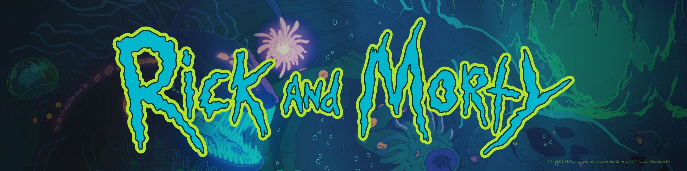

# Desafío Técnico – Conexa
Este proyecto es una aplicación web desarrollada con **Next.js**, enfocada en aplicar buenas prácticas de desarrollo frontend moderno con **TypeScript**, **SWR**, **Zustand** y componentes personalizados. El objetivo principal es explorar datos de personajes de la API de Rick and Morty mediante una interfaz clara y funcional.

🔗 **Deploy:** https://conexa.leogonzalezdev.com/  
🔗 **Repositorio:** [GitHub](https://github.com/leogonzalezdev/conexa-challenge.git)

---

## ✅ Requisitos cumplidos

- 🔄 Listado paginado de personajes, separados en secciones **Character #1** y **Character #2**
- 🧾 Cada personaje representado con una **Card** con su **status** y **especie**
- 🧩 Secciones de episodios:
  - Episodios únicos de Character #1
  - Episodios compartidos entre Character #1 y Character #2
  - Episodios únicos de Character #2

---

## ✨ Funcionalidades adicionales (extras)

- 🔍 **Buscador de personajes** con debounce y botón para limpiar la busqueda
- 🎨 **Visual feedback** por hover con efecto dinámico basado en el contenido de la imagen
- 💬 **Modal de detalle** para cada personaje con su información completa (nombre, especie, status, género y localización)
- 📺 **Detalle de episodio** al hacer clic (personajes participantes en ese episodio)
- 🔄 **Scroll infinito** optimizado con `SWRInfinite`
- ❌ Vista de "no resultados" cuando la búsqueda no encuentra coincidencias
- 🧪 Test unitario de algunas de las funcionalidades principales
- 📦 Deploy productivo con dominio personalizado en Vercel

---

## 🛠️ Tecnologías

- **Next.js** (App Router)
- **TypeScript**
- **Tailwind CSS**
- **Axios**
- **SWR** (manejo de cache y paginación)
- **Zustand** (estado global)
- **@headlessui/react** (modales accesibles)
- **Jest** (test unitario)
- **ESLint + Prettier**

---

## 🧩 Estructura del Proyecto

```
.
├── app/
│   ├── layout.tsx
│   └── page.tsx
├── assets/
├── components/
│   ├── CharacterCard/
│   ├── CharacterDetailModal/
│   ├── CharactersList/
│   ├── EpisodeCard/
│   ├── EpisodeDetailModal/
│   ├── EpisodesList/
│   └── Footer/
├── hooks/
│   ├── useCharactersByEpisode.ts
│   ├── useEpisodesByCharacters.ts
│   ├── useGroupedEpisodes.ts
│   └── useInfiniteCharacters.ts
├── services/
│   └── api.ts
├── stores/
│   └── useCharacterStore.ts
└── public/
```

---

## ⚙️ Instalación local

```bash
git clone https://github.com/leogonzalezdev/conexa-challenge.git
cd conexa-challenge
npm install
npm run dev
```

---

## 🧪 Testing

Se incluye un test unitario del hook `useInfiniteCharacters` y de algunos componentes utilizando **Jest**.

```bash
npm run test
```

---

## 🧠 Decisiones Técnicas

- **Zustand** para gestionar el estado compartido entre componentes sin boilerplate
- **SWR Infinite** para una paginación fluida y controlada
- **Headless UI** por su accesibilidad y compatibilidad con Tailwind CSS
- Separación estricta de responsabilidades por carpeta (`hooks`, `components`, `services`, `stores`)
- Uso de `assets` para mejorar experiencia visual ante búsquedas sin resultados